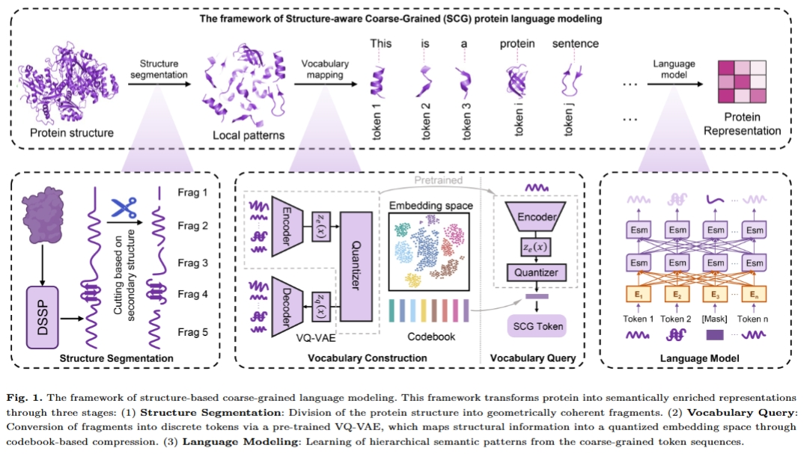

# Molecular-Level Protein Semantic Learning via Structure-Aware Coarse-Grained Language Modeling




## Installation

Create a virtual environment

``` sh
conda create -n scg python=3.10
conda activate scg
```

Install packages

```
bash environment.sh  
```


### Preprocessing

To extract the features corresponding to protein fragments, we first need to parse and obtain the PSSM, HHM, and DSSP related files of the protein. We provide the relevant parsing code, which is located in the `preprocess` directory.

We provide the related tools under `lib`.


## Dataset

We provide a list of PDB IDs for the pre-trained and downstream task datasets, which can be found in the "dataset" folder. Users can download protein structure on [RCSB PDB](https://www.rcsb.org/).

For downstream tasks, we provide both lists and labels.

> It's worth noting that for some PDB IDs, the chain IDs consist of two uppercase letters, which need to be mapped to lowercase letters. For example, for `7VXS_KK`, the actual PDB ID is `7VXS_k`.

## Pretrain vocabulary

Dataset path can be  configured in `config/param.yaml`

Switch to the `pretrain/vocabulary` folder and run the following code:

``` 
python training.py -c config/param.yaml
```


## Pretrain language model

Switch to the `pretrain/language_model/Bert-based` folder and run the following code:

```
python scripts/training.py -c config/scg.yaml
```


## Evaluate downstream tasks  performance

We provide the codes to evaluate downstream tasks under directary `downstream`.